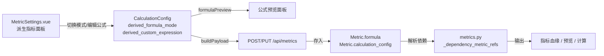

## 产品概述

在可信指标的“计算口径”页签中扩展“派生指标”模型，使其除保留原有“左指标 + 运算符 + 右指标”的简单模式外，新增“高级公式”子模式。用户可在高级模式下直接输入复杂 SQL 表达式（如 `ROUND(SUM(Delivery_completion)/COUNT(order_id),2)`），系统仍自动完成公式预览、依赖指标提取、血缘追踪与指标计算。

## 核心功能

- **简单/高级双模式切换**：派生指标区域增加“简单运算 / 高级公式”切换控件；默认仍为简单模式，保留现有左右选择器与四则运算按钮。
- **高级公式编辑区**：高级模式下展示多行文本域，支持手写任意 SQL 表达式；提供字段/聚合插入工具（选择字段 + 聚合函数 + 插入按钮），光标处自动插入如 `SUM(orders.delivery_completion)`。
- **实时公式预览**：高级模式下预览面板直接显示当前文本域内容；简单模式下仍按原逻辑生成预览。
- **依赖指标自动提取**：高级公式保存时，前端从表达式中识别 `metric:NNN` 引用及命中的可信指标名称，写入 `calculation_config.dependency_metrics`；后端在血缘接口中同步解析 `derived_custom_expression` 以生成依赖列表。
- **公式应用回退**：当“公式预览”或 AI 候选公式无法映射到简单二元配置时，自动切换到高级模式并回填表达式。
- **输出别名与计算口径**：高级模式下仍保留“输出别名”字段，最终 SQL 表达式写入 `Metric.formula`，后端预览、计算、质量检查逻辑无需改动。

## 技术栈

- 前端：Vue 3 + TypeScript + Vite + Element Plus（沿用项目现有栈）
- 后端：Python 3.12 + FastAPI + SQLAlchemy 2（沿用项目现有栈）
- 存储：`Metric.calculation_config` JSON 字段扩展新键，无需数据库迁移。

## 实现方案

在派生指标模型中引入子模式字段 `derived_formula_mode`（`simple` | `advanced`）与 `derived_custom_expression` 字符串字段。

- 简单模式保持现有逻辑：由 `derived_left_field`、`derived_operator`、`derived_right_field` 生成 `derived_expression`，最终写入 `formula`。
- 高级模式下，`formulaPreview` 直接返回 `derived_custom_expression`；保存时 `formula` 取该表达式，`dependency_metrics` 通过正则扫描表达式中的 `metric:\d+` 及与当前数据集可信指标名称/标签的匹配结果生成。
- 后端 `_dependency_metric_refs` 扩展为同时扫描 `config.get("derived_custom_expression")` 中的 `metric:NNN` 标记；`_metric_source_fields` 提取表达式中的字段名（基于正则匹配标识符）作为源字段；`_metric_calculation_summary` 透传新字段以便前端展示。
- 静态测试已禁止直接 `v-model="form.calculation_config.derived_expression"` 与 `v-model="form.formula"`，新字段命名为 `derived_custom_expression`，不直接绑定到 `form.formula`。

## 关键执行注意

- 保持向后兼容：未设置 `derived_formula_mode` 的旧数据默认按 `simple` 处理。
- SQL 安全：高级表达式仍走现有 `_sanitize_formula_expression` 清洗逻辑，拒绝 `;`、`--`、`/*`、`*/`、`\x00`。
- 性能：依赖提取为纯正则扫描，计算量为 O(表达式长度)，无额外数据库查询；后端血缘解析仅读取已存储的 `calculation_config`。
- 避免 N+1：前端字段插入工具复用现有的 `derivedMetricOperandGroups` 计算属性，不重复请求数据集字段。
- 类型安全：更新 `CalculationConfig` 接口与 `normalizeCalculationConfig`，确保 `vue-tsc` 通过。

## 架构设计



## 目录结构

```
e:/smart_bi/
├── frontend/
│   └── src/
│       └── views/
│           └── MetricSettings.vue          # [MODIFY] 派生指标区域新增简单/高级切换、高级公式编辑区、字段插入工具、模式相关计算属性与 payload 构建逻辑
├── backend/
│   └── app/
│       └── api/
│           └── metrics.py                    # [MODIFY] 扩展 _dependency_metric_refs、_metric_source_fields、_metric_calculation_summary 支持 derived_custom_expression
├── frontend/
│   └── tests/
│       └── biAnalysisMetricCertifier.test.mjs # [MODIFY] 补充高级模式控件存在性断言
└── backend/
    └── tests/
        └── test_metric_trust_center.py      # [MODIFY] 补充高级派生公式保存、预览与血缘测试
```

## 关键代码结构

新增 `CalculationConfig` 字段（前端局部接口）：

```typescript
interface CalculationConfig {
  // ... 现有字段
  derived_formula_mode: "simple" | "advanced";
  derived_custom_expression: string;
}
```

## 设计风格

延续 Element Plus 企业级后台的清晰、结构化风格，在现有“派生运算”卡片内增加模式分段控件，使用微妙的背景色区分简单/高级两种编辑状态，保持与“聚合指标”“比率指标”等相邻模块的视觉一致性。

## 页面区块

- **模式切换条**：在“派生运算”标签右侧放置 `el-segmented` 控件，选项“简单运算 / 高级公式”；选中项使用主色填充，未选中项使用浅灰背景。
- **简单模式区**：保留原有左右两个 `el-select` 选择器与四个圆形运算符按钮，布局不变。
- **高级模式区**：
- 顶部为字段插入工具栏：字段下拉（使用 `derivedMetricOperandGroups`）、聚合函数下拉（SUM/COUNT/AVG/MIN/MAX/无）、插入按钮；点击后在下方文本域光标处插入对应表达式。
- 中部为 `el-input` type="textarea" 的多行公式编辑区，等宽字体，占位文本示例：`ROUND(SUM(delivery_completion) / COUNT(order_id), 2)`。
- 底部为 `small.builder-hint`，提示支持标准 SQL 函数及自动提取依赖指标。
- **公式预览面板**：位于高级模式区下方，与现有预览面板共用，直接展示用户输入表达式；右侧“应用预览公式”按钮保持可用，若无法映射到简单模式则自动切到高级模式。
- **输出别名**：高级模式下仍显示“输出别名”输入框，与简单模式保持一致。