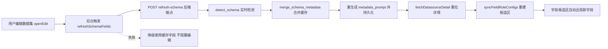

## 用户需求

修复 bug：已有数据集在物理表（主表或关联表）新增字段后，编辑该数据集时，业务口径的"字段候选区"没有自动新增相应字段。

## 产品概述

数据集编辑器的业务口径步骤（DatasetCenter.vue 字段候选区）应始终反映物理表的最新结构：编辑数据集时自动同步新增字段，无需用户手动操作；同时保留用户已保存的字段角色、别名与字段说明。

## 核心功能

- 编辑已有数据集时，自动刷新主表与关联表的表结构，新增字段自动出现在字段候选区
- 保留已配置字段的角色（维度/指标/忽略）、别名、聚合方式与已有字段说明，仅追加新字段
- 刷新失败（数据库不可达等）时优雅降级，继续使用缓存的字段列表，不阻塞编辑
- 手动点击"检测表结构"后，字段候选区同步重建并展示新字段（修复现有按钮不生效的问题）

## 技术栈

- 后端：FastAPI（Python 3.12）+ SQLAlchemy 2，复用既有 schema 检测与审计日志模式
- 前端：Vue 3 Composition API + TypeScript + Element Plus，改动集中在 DatasetCenter.vue

## 根因分析

业务口径字段候选区由 `fieldRoleConfigs` 渲染，经 `syncFieldRoleConfigs()` → `columnsForTable()` 读取数据源记录上**缓存的 `schema_metadata`**。存在两处缺陷：

- 缺陷 A：`openEdit` 只读取缓存的数据源详情，从不刷新 schema，物理表新增字段永远进不了候选区
- 缺陷 B：`detectSchema` 成功后仅在 `form.table` 为空时才调用 `selectTable`（内部才重建字段配置）；编辑已有数据集时 `form.table` 非空，即使手动刷新表结构候选区也不更新

## 实现方案

### 后端：新增合并式刷新端点 `POST /api/datasources/{id}/refresh-schema`

- 实时调用 `detect_schema(ds.database_url, ds.source_type)` 获取最新结构
- 新增 `merge_schema_metadata(previous, fresh)` 合并函数：以实时结构为准，**保留缓存中已有表/列的 description（含 AI 生成的字段说明）与已有 relationships（状态/置信度/证据）**，追加新表、新列、新关系，避免全量覆盖造成说明丢失
- 用合并结果重新生成 `metadata_prompt`（`schema_to_prompt`）并持久化 `schema_metadata`，记录审计日志，返回合并后的 schema
- 不修改现有 `detect-schema` 端点语义（SchemaMetadataModal 仍依赖全量覆盖式检测）

### 前端：自动刷新与候选区重建

- 新增 `refreshSchemaFields()`：调用 refresh-schema → `fetchDatasourceDetail` 重拉详情 → `syncFieldRoleConfigs("suggest")`（`previous` map 按 key 保留已配置字段的角色/别名/聚合，仅追加新列）→ 兜底校正 `filterField` 下拉值
- `openEdit` 打开抽屉后后台触发 `refreshSchemaFields()`（不阻塞编辑；失败仅提示"使用缓存字段"）
- 修复 `detectSchema`：刷新成功后无论 `form.table` 是否为空都调用 `syncFieldRoleConfigs("suggest")` 重建字段配置

## 架构设计



## 性能与可靠性

- 合并为 O(表数+列数) 的字典查找，一次编辑仅触发一次刷新，无热路径开销
- 复用 `try_record_audit_log` 审计，不记录 schema 大 payload，避免日志膨胀
- 刷新失败捕获异常并降级到缓存 schema，保证编辑流程可用；破坏面仅限新增端点与候选区重建，不动现有 detect-schema 语义

## 目录结构

```
backend/
├── app/core/schema_detector.py      # [MODIFY] 新增 merge_schema_metadata(previous, fresh)，复用 _relationship_key
├── app/api/datasource.py            # [MODIFY] 新增 POST /{datasource_id}/refresh-schema 端点（检测→合并→prompt→持久化→审计），导入 merge_schema_metadata
└── tests/test_schema_refresh.py     # [NEW] 合并函数单测 + 端点集成测试（sqlite 临时库模拟 ALTER TABLE 新增列、说明保留、prompt 更新、审计）
frontend/
├── src/views/DatasetCenter.vue      # [MODIFY] 新增 refreshSchemaFields()；openEdit 打开抽屉后触发；修复 detectSchema 重建字段配置
└── tests/datasetPreviewDraft.test.mjs  # [MODIFY] 新增静态断言：openEdit 调用 refreshSchemaFields、refresh-schema 端点、syncFieldRoleConfigs 重建
```

## 关键代码结构

```python
# backend/app/core/schema_detector.py
def merge_schema_metadata(previous: SchemaMetadata | None, fresh: SchemaMetadata) -> SchemaMetadata:
    """以 fresh 为准合并结构：保留已有表/列 description，追加新表/新列；保留已有 relationships 并追加新关系。"""

# backend/app/api/datasource.py
@router.post("/{datasource_id}/refresh-schema", response_model=SchemaMetadata)
def refresh_datasource_schema(datasource_id: int, db=Depends(get_db), current_user=Depends(get_current_user)):
    """增量刷新表结构：检测→合并→重生成 metadata_prompt→持久化→审计日志→返回合并 schema。"""
```

```ts
// frontend/src/views/DatasetCenter.vue
const refreshSchemaFields = async (): Promise<void> => {
  // 调用 /api/datasources/${id}/refresh-schema → fetchDatasourceDetail → syncFieldRoleConfigs("suggest")
  // 失败时 ElMessage.warning 降级，不阻塞编辑
}
```

## Agent Extensions

### SubAgent

- **code-explorer**
- 用途：在新增 refresh-schema 端点前，核查 detect-schema 端点与 schema_metadata 的全部调用点（query.py、metrics.py、catalog.py、SchemaMetadataModal.vue 等），确认合并式刷新不破坏现有行为
- 预期结果：输出完整的调用点清单与影响结论，确保新增端点与候选区重建的破坏面可控