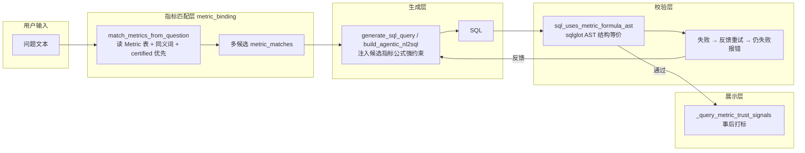

## 需求概述

修复智能问数中"可信指标口径不一致"的 bug：业务问数（business）与探索模式（agentic）在命中已认证可信指标时，生成的 SQL 有时未严格按可信指标的查询字段/公式执行，导致结果口径漂移。

## 核心修复点（用户已确认）

- 修复范围：business 与 agentic 两条链路都修，统一接入可信指标强约束
- 校验方式：引入 sqlglot（SQL AST 解析），以结构级校验替代现有文本包含校验
- 指标匹配：直接从 Metric 表读取（certified 优先、多候选、支持同义词），不再依赖脆弱的文本子串匹配与已同步的 metrics_prompt 快照

## 验收标准

- 命中可信指标后生成的 SQL 必须通过 AST 结构级口径校验（聚合函数、字段、WHERE 条件结构等价），拦截"公式+额外变换"的口径漂移
- 用户措辞与指标名不一致（同义词/修饰词前置/口语化）时仍能命中已认证指标
- business 与 agentic 两条链路行为一致；未命中指标时保持原有自由生成能力
- 现有 API 响应结构（trust_signals、semantic_context、agent_trace 等）保持兼容

## 技术栈

- 后端：Python 3.12 + FastAPI + SQLAlchemy 2（沿用现有架构，不做新框架）
- 新增依赖：sqlglot（SQL AST 解析，用于结构级口径校验），加入 `backend/pyproject.toml` dependencies
- 测试：pytest + ruff（沿用 AGENTS.md 后端工作流）

## 实现方案

### 总体策略

围绕"命中可信指标 → 公式硬约束注入 → AST 结构级校验 → 失败重试 → 明确报错"的闭环，统一改造 business 与 agentic 两条链路。指标匹配从"文本子串匹配 metrics_prompt"升级为"直接读 Metric 表 + 语义同义词 + certified 优先 + 多候选"，消除措辞不一致导致的漏命中；校验从"字符串包含"升级为"sqlglot AST 结构等价比对"，消除口径漂移的假阳性与等价写法的假阴性。

### 关键设计决策

1. **指标匹配升级**：新增 `match_metrics_from_question(db, question, datasource, dataset_id=None) -> list[dict]`，直接查询 `Metric` 表（过滤 `datasource_id`、`is_active=1`、`status="published"`、`certification_status != "deprecated"`），按匹配强度（原名 > 分词 > 同义词）分组、certified 优先排序，返回多候选。同义词来源：数据集语义模型 `infer_semantic_model` 的 `synonyms`（term → 指标/字段 target）与指标名括号内别名。保留 `match_metric_from_question(question, datasource)` 旧签名作为降级路径（无 db 时解析 metrics_prompt），避免破坏外部兼容。
2. **AST 结构级校验**：在 `metric_binding.py` 新增 `sql_uses_metric_formula_ast(sql, formula) -> bool`——将公式解析为 `SELECT <expr> WHERE ...` 的 AST，提取 select 聚合表达式与 where 条件列表；对 AST 做规范化（剥离表限定符、数值常量、NULLIF(x,0)/COALESCE 等价包裹、别名），比较投影表达式结构等价 + where 条件（列、操作符、字面量值）逐一匹配。改造 `sql_uses_metric_formula` 为 AST 优先、解析失败时回退现有文本逻辑，保证与既有测试兼容。
3. **business 链路**：`_generate_safe_sql` 与 `generate_sql_query` 接收 `metric_matches: list[dict]`，prompt 注入全部候选（primary=certified 优先的第一个，用"必须使用以下指标公式"措辞；其余作为参考口径）；生成后对 primary 公式做 AST 校验，失败携带反馈重试一次，仍失败报错并附候选指标信息。
4. **agentic 链路**：`build_agentic_nl2sql` 新增 `metric_matches` 参数，在 `_build_datasource_context` 输出中追加"目标指标口径（必须遵守）"段落；`_validate_agentic_sql` 增加公式校验，失败抛 ValueError 进入现有 repair 循环，feedback 明确"未使用目标指标公式"；`ask_stream` 与 `ask` 的 agentic 分支传入 `metric_matches`。
5. **可信信号一致性**：`_query_metric_trust_signals` 与 `_build_business_semantic_context` 适配 list 参数，保证展示的 trust_signals 与强约束使用的指标一致（仍为事后展示语义，不参与生成）。

### 性能与可靠性

- Metric 表查询为单表小数据量（按数据源过滤），每次问数一次查询，可接受；必要时后续可加短 TTL 缓存，本次不引入避免复杂度。
- AST 校验仅作用于生成结果（1 条 SQL），解析开销可忽略；sqlglot 解析失败一律回退文本校验，保证不因解析异常阻断主流程。
- 重试次数保持现有上限（business 1 次、agentic 2 次 repair），不改变用户可见的失败语义（HTTP 502 + 明确错误信息）。

### 架构图

## 实现注意事项

- 修改 `match_metric_from_question` 调用点的同时，必须同步更新 `backend/tests/test_query_trust_signals.py`（L100 patch）与 `backend/tests/test_query_dataset_scope.py`（L118 patch）的 mock 目标与返回形态（dict → list）。
- 保持 `generate_sql_query` 的 `metric_match` 单数参数向后兼容（内部转 list），避免影响其他调用方；`metric_match` 单数变量在 query.py 中保留为首个候选，用于 trust_signals/semantic_context 展示。
- sqlglot 版本选择与 Python 3.12 兼容的稳定版，写入 pyproject.toml 后执行 `uv sync` 更新锁文件。
- 日志复用现有 `try_record_audit_log`，错误信息包含候选指标名与公式，不打印完整 SQL 大 payload。

## Agent 扩展

### SubAgent

- **code-explorer**
- 用途：改造 business/agentic 链路前，确认 `match_metric_from_question`、`sql_uses_metric_formula`、`generate_sql_query` 的全部调用点与测试引用，避免遗漏回归面
- 预期结果：输出完整调用点清单，保证改造无遗漏、测试同步更新

### Skill

- **lsp-code-analysis**
- 用途：对 `metric_binding.py`、`query.py`、`agentic_nl2sql.py` 的改动做符号级引用核验（函数签名、导入、patch 目标），验证改动后无悬空引用
- 预期结果：改造后所有符号引用一致，类型检查与 lint 通过