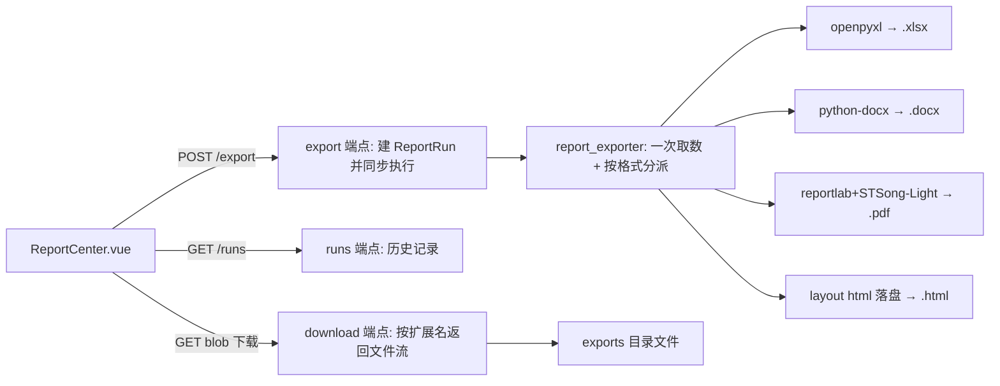

## 产品概述

报表中心（`/report-center`）目前"导出"仅提交任务却拿不到文件，实际没有可用的下载能力。本次扩展补齐端到端下载闭环，并让宣传中的导出能力真正落地。

## 核心功能

- **点击即下载**：对绑定数据集的复杂报表，点击"导出 Excel / PDF / Word"后等待后端生成完成，浏览器自动下载对应格式文件。
- **导出记录中心**：每个报表可打开"导出记录"抽屉，查看历史导出任务（格式、状态、时间、失败原因），已完成任务可随时再次下载。
- **AI 报表（ai_html）下载**：无数据集的 AI 报表新增"下载 HTML"能力，将报表 HTML 内容下载为本地 `.html` 文件（维持现有预览不变）。
- **格式能力对齐**：后端真正支持 Excel / PDF / Word / HTML 四种导出，下载接口按格式返回正确的 MIME 类型，界面与后端能力保持一致。

## 技术选型

- 后端：沿用 FastAPI + SQLAlchemy 2（Python 3.12，uv 管理），新增纯 Python 依赖 `python-docx`（Word）与 `reportlab`（PDF）；HTML 直接落盘无需依赖。
- 选型理由：两者均为纯 Python 包、Windows/Linux 通用，无需系统级二进制（规避 weasyprint/wkhtmltopdf 的 GTK 依赖问题）；与现有 `uv` 工作流和 openpyxl 风格一致。
- 前端：沿用 Vue 3 + TypeScript + Element Plus；浏览器端下载使用项目已安装的 `file-saver`（`saveAs`）与 axios `responseType: "blob"`，利用 main.ts 中 axios 默认携带的 Bearer Token 完成鉴权下载（裸 `<a href>` 无法带 token）。

## 实现思路

以"点击导出 → 同步生成文件 → 携带鉴权拉取文件流并保存"为链路：后端在 `report_exporter` 中按格式分派渲染器，前端在 `ReportCenter.vue` 提交导出后自动触发 blob 下载；"导出记录"复用现有 `GET /{template_id}/runs` + `GET /runs/{run_id}/download` 接口。

### 关键决策与理由

1. **导出数据一次查询、多格式复用**：把"取数据集 + 列 + 行 + 参数"抽为共享步骤，Excel/PDF/Word 共用，避免每种格式重复查询数据源（性能与一致性）。
2. **PDF 中文用内置 CID 字体**：`reportlab.pdfbase.cidfonts.UnicodeCIDFont("STSong-Light")`，报表名/数据集名/数据均为中文，Helvetica 会渲染成方块；该字体是 reportlab 内置资源，无需外部字体文件。
3. **下载接口 media_type 动态化**：按 `path.suffix` 查表返回 `.xlsx/.pdf/.docx/.html` 对应 MIME，替代当前硬编码的 xlsx。
4. **ai_html 能力边界**：仅允许 `export_type="html"`（读取 `layout_json.html` 落盘）；无数据集模板请求 excel/pdf/word 时后端明确报错，前端仅展示"下载 HTML"，避免误导。
5. **导出记录不做额外表结构**：`ReportRun.output_uri` 已可存任意扩展名文件名，仅需新增 UI，无数据库迁移。

## 执行细节（防回归）

- 文件名统一沿用 `report_run_{run_id}_{时间戳}.{ext}` 存入 `get_export_dir()`（默认 `backend/exports`），download 接口的 basename/路径穿越防护保持不动。
- 前端下载文件名用用户友好命名（如 `${报表名}-v${版本}-${时间}.xlsx`），由 `saveAs(blob, name)` 指定，不依赖后端 `Content-Disposition`。
- axios 下载失败（400/404）时响应体是 Blob，全局拦截器无法读出 `detail`：在 catch 中把 Blob 文本化解析 `detail` 提示，避免出现误导性的"服务异常"。
- 保持 `EXPORT_ROW_LIMIT=5000`；PDF 用 platypus 自动分页、表头跨页重复（`repeatRows=1`）；Word 用 `Table Grid` 样式表格，行数据分批 `add_row` 追加。
- 不触碰 preview/fill/版本管理/审计与权限逻辑；export/download 已带 `report.export` 权限校验，无需新增。
- 依赖通过 `uv add python-docx reportlab` 安装并更新 `uv.lock`，不手写 lock 文件。
- 测试中生成的导出文件写入后需断言并清理，避免污染 `backend/exports` 与工作区。

## 架构设计

改动集中在导出链路上，分层清晰，无需新增服务/模块，不引入新的架构模式：



## 目录结构与改动清单

```
backend/
├── pyproject.toml                            # [MODIFY] 新增 python-docx、reportlab 依赖
├── app/
│   ├── core/
│   │   └── report_exporter.py                # [MODIFY] 核心扩展：SUPPORTED_EXPORT_TYPES 放开四格式；
│   │                                         #   新增 build_pdf_file/build_word_file/build_html_file；
│   │                                         #   execute_report_export 按类型分派并共享取数步骤；
│   │                                         #   ai_html 无数据集仅走 html 分支
│   └── api/
│       └── report_templates.py               # [MODIFY] download 接口按文件扩展名映射 media_type；
│                                             #   export 端点对无数据集模板的 excel/pdf/word 早期校验报 400
└── tests/
    ├── test_report_templates.py              # [MODIFY] 新增 pdf/word/html 生成、download media_type、ai_html 边界测试
    └── test_ai_reports.py                    # [MODIFY]（如需要）publish-to-report-center 后 html 下载闭环测试
frontend/
└── src/
    └── views/
        └── ReportCenter.vue                  # [MODIFY] 导出下拉菜单+点击即下载；导出记录抽屉；
                                              #   ai_html 行新增"下载 HTML"按钮；下载失败 Blob 错误解析
```

## 关键代码结构

仅列出跨模块契约，实现细节以既有风格为准：

```python
# report_exporter.py 导出器契约
SUPPORTED_EXPORT_TYPES = {"excel", "pdf", "word", "html"}  # 原为 {"excel"}

def execute_report_export(db, template, run) -> tuple[Path, int]:
    # 1) export_type == "html"：读取 template.layout_json["html"] 写 .html 文件（ai_html 无数据集）
    # 2) 其余：校验 dataset_id 存在 → 共享取数(columns/rows/parameters) → 按格式调用渲染器

# download 端点 MIME 映射（按 path.suffix 取，默认 application/octet-stream）
_EXPORT_MEDIA_TYPES = {
    ".xlsx": "application/vnd.openxmlformats-officedocument.spreadsheetml.sheet",
    ".pdf": "application/pdf",
    ".docx": "application/vnd.openxmlformats-officedocument.wordprocessingml.document",
    ".html": "text/html; charset=utf-8",
}
```

延续报表中心现有企业工作台风格（白底卡片、青绿色主色、8px 圆角、`--app-*` 设计变量），不引入新的视觉体系。三处增量 UI 均使用 Element Plus 既有组件并遵守既有工具栏/表格布局：

1. 操作列（非 AI 报表行）：将分散的 Excel/PDF/Word 三个小按钮收敛为 `el-dropdown`"导出"按钮（主按钮 Download 图标 + 下拉三项），保持操作列整洁；另加"导出记录"图标按钮进入抽屉。AI 报表行在"预览"旁新增 Download 图标按钮，tooltip 提示"下载 HTML 文件"。
2. 导出记录抽屉：右侧 `el-drawer`（宽约 520px），标题为报表名，含空态；每行以状态 `el-tag`（成功/失败/处理中）区分，展示格式、版本、导出时间、行数/错误信息（错误用 muted 小字或 tooltip），completed 行提供"下载"文字按钮；抽屉头部提供"立即导出 Excel"快捷按钮，成功后自动刷新列表并提示文件已开始下载。
3. 交互反馈：导出进行中按钮 loading 态；成功 toast"报表已开始下载"；失败 toast 具体 detail；下载文件名用户友好（报表名-版本-时间戳.扩展名）。

整体维持信息密度适中、状态可视化清晰的企业风格，不改变页面框架与配色。