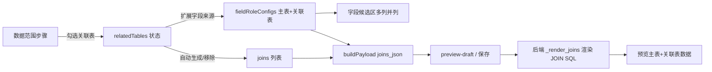

## 产品概述

在现有数据集设计器中扩展多表关联能力：数据范围步骤可勾选关联表，系统自动建立 Join 关系，字段候选区按表并列展示，数据预览同时呈现主表与关联表数据。

## 核心功能

- 数据范围步骤在"主表"下方新增"关联表"多选区域，可勾选除主表外的任意多张表（复用现有 table-tile 卡片交互）
- 勾选关联表后，高级建模的 Join 关系自动生成对应 LEFT JOIN（主表 ↔ 关联表，按字段名智能推断关联列）；取消勾选时自动移除对应 Join；切换主表时重算关联关系
- 字段候选区从单列改为多列并列：主表一列 + 每个关联表一列，各列含独立表头（表名 + 字段数）与字段配置行，搜索与用途筛选对全部表生效
- 数据预览与数据集保存时，维度/指标/筛选/Join 均支持主表与关联表字段（字段以 `表名.字段名` 标识，天然支持多表）
- 编辑回显：打开已保存数据集时，从 joins_json 解析关联表并回填勾选状态，字段配置与 Join 列表完整还原

## 技术栈

- 前端：Vue 3 + TypeScript + Element Plus（沿用现有 DatasetCenter.vue 的响应式状态与组件模式）
- 后端：FastAPI（backend/app/api/datasets.py 已支持多表 Join，仅做校验加固）

## 实现方案

以"关联表选择状态驱动"为核心：新增 `relatedTables` 状态，勾选/取消时自动生成或移除 Join 字符串（格式 `"LEFT JOIN a.id = b.id"`，与后端 `JOIN_RE`（datasets.py 66-72 行）和 `_render_joins`（495-516 行）完全兼容）；`fieldRoleConfigs` 由"仅主表"扩展为"主表 + 全部关联表"，字段 key 沿用 `table.column`，后端 `_quote_column_ref`（272 行）与 `_validate_database_table_and_columns`（288 行，对 `field_table != table` 跳过校验）已天然支持。

### 关键设计决策

1. **自动 Join 推断**（新函数 `buildAutoJoin(mainTable, relatedTable)`）：优先匹配同名列 `id` → 同名列中 `*_id` 模式 → 任意同名列 → `<related_table>_id`/`<main_table>_id` 不对称模式 → 首列兜底；生成 `LEFT JOIN` 并通过 `uniquePush`（1666 行）去重写入 `joins.value`
2. **双向同步**：`toggleRelatedTable` 勾选时自动加 Join，取消时移除与该表相关的 Join（匹配 `removeJoin` 语义）；在高级建模手动删除自动 Join 时同步取消对应关联表勾选，保持 UI 与数据一致
3. **回显顺序**：`openEdit`（1879 行）需先设置 `form.table` → 从 `dataset.joins_json.joins` 解析出除主表外的表写入 `relatedTables` → 再调 `applySavedFieldModel`（1779 行），确保 `syncFieldRoleConfigs`（1726 行）已包含关联表字段，回填按 key 才能命中
4. **多列布局**：`visibleFieldConfigs` 保持扁平过滤（搜索/用途筛选全局生效），新增 `fieldConfigsByTable` computed 按表分组渲染多列；`currentFieldOptions`（1148 行）扩展为主表 + 关联表，使筛选/下钻可选关联表字段
5. **性能**：`syncFieldRoleConfigs` 重建为 O(全部表列数)，列数规模小无瓶颈；分组 computed 每次渲染 O(n)，无需缓存

### 状态与函数改动点（frontend/src/views/DatasetCenter.vue）

- 新增：`relatedTables = ref<string[]>([])`（1018 行 joins 附近）；`buildAutoJoin`、`toggleRelatedTable`、`fieldConfigsByTable`、`parseRelatedTablesFromJoins`
- 修改：`syncFieldRoleConfigs`（1726-1747）遍历 `[form.table, ...relatedTables]` 各表列；`resetForm`（1809）清空 `relatedTables`；`selectTable`（1919）切换主表时清空关联表与自动 Join；`handleDatasourceChange`（1907）清空 `relatedTables`；`openEdit`（1879）回填 `relatedTables`；`removeJoin`（2039）匹配自动 Join 时同步取消勾选；`currentFieldOptions`（1148）扩展多表
- 模板：数据范围 section（161-236）主表下方新增"关联表"多选区块；字段候选区（263-362）改为多列并列；hero 区（265-272）展示主表 + 关联表标签
- 样式：文件底部 scoped style 新增 `.related-table-picker`、`.field-config-columns`、`.field-config-column`、`.field-column-head` 等，沿用现有卡片/圆角/阴影体系

### 后端改动（backend/app/api/datasets.py）

- 新增 `_validate_join_references(engine, default_table, joins)`：校验 Join 引用的表与关联列真实存在，在数据库 SQL 构建路径（601 行 `_validate_database_table_and_columns` 调用处附近）追加调用，覆盖 preview-draft 与正式查询，避免运行时 SQL 报错

## 系统架构



## 目录结构

```
frontend/src/views/DatasetCenter.vue  # [MODIFY] 主修改文件：relatedTables 状态、自动 Join 推断与同步、字段候选区多列并列、数据范围关联表选择区、相关样式
backend/app/api/datasets.py          # [MODIFY] 新增 _validate_join_references 并在 SQL 构建路径调用，校验 Join 表/列存在性
```

## 关键代码结构

```ts
// 自动 Join 推断（仅签名，实现见上）
function buildAutoJoin(mainTable: string, relatedTable: string): string
// 返回如 "LEFT JOIN orders.id = customers.id"，无匹配列时返回 ""

// 关联表勾选切换：勾选→uniquePush 自动 Join；取消→过滤移除该表相关 Join
function toggleRelatedTable(tableName: string): void

// 按表分组的字段候选列（主表在前，关联表按选择顺序）
const fieldConfigsByTable: ComputedRef<Array<{ table: string; configs: FieldRoleConfig[] }>>
```

沿用现有数据集设计器的浅色卡片风格（Element Plus + #2563eb 品牌蓝），新增两块 UI 均与既有交互保持一致：

1. 关联表选择区：位于"主表"卡片下方，复用 table-tile 卡片式多选按钮（选中态蓝色描边 + 浅蓝底），上方 panel-title 显示"关联表"与已选数量，支持 el-tag 展示已选表名摘要。

2. 字段候选区多列并列：hero 区显示主表名 + 关联表 el-tag 列表；下方由单列改为横向滚动多列布局（主表列置左，各关联表按选择顺序排列），每列含表头（表名 + 字段数徽标）与纵向滚动字段配置列表，列间以细分割线分隔；搜索框与用途筛选 Tab 悬浮于列区上方全局生效。空列显示轻量 empty 提示。

交互：勾选/取消关联表即时重算 Join 与字段列；多列区支持横向滚动，窄屏下列宽不低于 280px，避免挤压字段控件。

## Agent Extensions

### Skill

- **accessibility-auditor**
- 用途：对新增的关联表选择区与字段候选多列区进行 WCAG 2.2 审计（键盘导航、ARIA 状态、对比度），发现并输出修复建议
- 预期结果：多列并列布局与卡片按钮具备完整键盘可达性与屏幕阅读器语义，修复审计发现的问题后回归