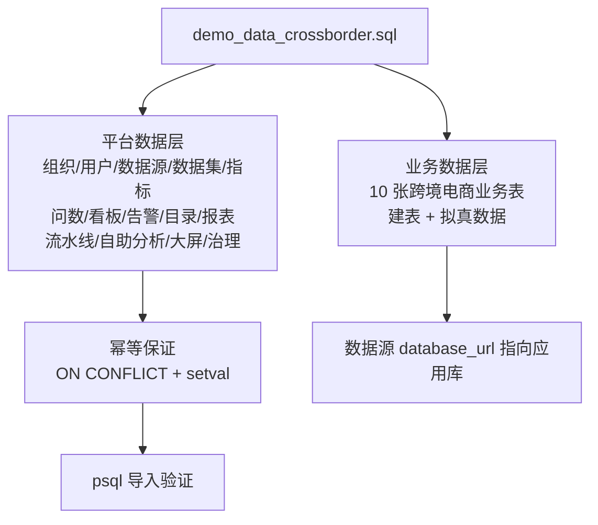

## 用户需求

1. 完整扫描项目，确定 Smart BI 平台的具体功能，并在交付时给出功能清单说明。
2. 生成一份可导入 PostgreSQL 的演示数据 SQL 文件，业务场景为**跨境电商**。
3. 覆盖范围采用"完整闭环"：跨境电商业务数据表 + 平台全部核心功能表（组织/用户/数据源/数据集/指标/看板/固定图表/查询历史/告警/行动项/数据目录/复杂报表/数据流水线/自助分析/大屏/RLS/审计/访问申请等），导入后即可登录并演示所有功能。

## 产品概述

- 交付物：项目根目录新增 `demo_data_crossborder.sql`（单文件、psql 可导入），并在最终回复中输出项目功能清单。
- 业务主体：跨境电商企业"跨海优选"（组织 slug `crossborder`），包含多平台店铺（Amazon/Shopee/TikTok Shop/独立站）、多站点（美国/德国/英国/日本/东南亚）、商品 SKU、跨境物流、支付渠道、会员运营等。
- 业务数据表与平台功能表放同一 PG 库（参照 `feature_demo_setup.py` 同库模式），数据源 `database_url` 指向应用库，导入后可直接演示智能问数、指标、看板、预警等闭环。

## 核心功能（用于确定演示数据内容）

- 数据源中心、语义数据集（含刷新日志）、可信指标（认证/血缘/质量状态）
- 智能问数（NL2SQL 查询历史、推荐图表、固定图表）
- 看板中心（布局、评论、分享、嵌入 Token）、大屏中心
- 数据目录（分类、资产、血缘、订阅、通知）
- 告警与定时报告（阈值预警、预警历史、行动项闭环）
- 复杂报表（模板、版本、运行、填报记录、执行日志）
- 数据流水线（DAG、运行、版本、质量规则）
- 自助分析视图（计算字段、钻取联动）
- 多租户 RBAC（组织/部门/用户/角色/RLS/审计日志/访问申请）

## 技术栈

- PostgreSQL 16 标准 SQL（psql / pgAdmin 均可直接导入）
- 严格遵循现有 `mock_data.sql` 的书写规范：`BEGIN;` 事务包裹、`INSERT ... ON CONFLICT ... DO UPDATE/NOTHING` 幂等、`SELECT setval(...)` 重置自增序列
- 用户密码采用 passlib bcrypt 哈希（与后端 `app/core/security.py` 的 `verify_password` 兼容，用户可直接登录演示账号）

## 实现方案

1. **深度提取表结构**：逐表读取 `backend/app/models/*.py`（33 个模型、49 张表），提取精确的列名/类型/非空约束/默认值；对照现有 `mock_data.sql` 已覆盖的表（20+ 张）复用其字段与 JSON 格式写法，未覆盖的表（datasources、dashboards、big_screens、audit_logs、embed_tokens 等）按模型字段新建数据。
2. **业务数据建模**：参考 `demo_setup.py` 的随机生成思路（固定随机种子保证可复现、带业务趋势：Q4 旺季、月度冲刺、平台差异），为跨境电商设计约 10 张业务表（订单、订单明细、商品 SKU、客户、店铺/站点、物流、支付、会员、月度 KPI、广告投放），用 `CREATE TABLE IF NOT EXISTS` + 批量 INSERT 生成 2024-2025 年拟真数据，确保指标丰富、可支撑全部演示路径。
3. **平台数据闭环**：按"组织 → 用户/部门 → 数据源 → 数据集 → 指标 → 查询历史/固定图表/看板 → 告警/行动项/定时报告 → 目录/报表/流水线/自助分析/大屏 → 治理数据"的依赖顺序组织数据；FK 引用严格按 ID 对应，所有平台表均用 `ON CONFLICT` 幂等处理，避免与后端 `main.py` 启动种子（nexteer/carsem 组织 id=1-2、admin 等）冲突，新组织从 id=3 起分配。
4. **验证与收尾**：生成后先做 SQL 语法与引用完整性自查（括号配对、JSON 合法、ID 交叉引用核对），再通过 `psql` 实导入验证（若环境无 psql 则以 SQL 静态检查替代），确认退出码 0 且无外键错误后交付。

## 执行细节（防回归）

- **兼容性**：不修改任何现有代码/表；新 SQL 只做幂等 INSERT，重复执行安全；不破坏现有 mock_data.sql 已管理的业务记录（orgs id=1-2、datasources id=1-5、metrics id=1-10、dashboards id=1-4 等均不触碰）。
- **数据源连接**：业务表与应用同库，datasources.database_url 写入默认 `postgresql+psycopg2://...` 格式并在文件头注释提示按部署环境调整。
- **密码哈希**：用后端 `get_password_hash` 生成演示账号 bcrypt 哈希，并在 SQL 注释标注明文密码，确保登录可用。
- **性能**：业务表数据控制在每表几百至几千行（订单约 3-5 千行），SQL 文件体积适中，导入耗时秒级；JSON 字段（layout_json、dag_json、fields_json 等）给出简洁有效的结构，避免超长冗余。
- **可维护性**：文件按 15 个编号分节 + 段首注释，每节职责单一，方便用户按需裁剪。

## 架构设计

采用"业务层 + 平台层"两段式结构，全部在单个事务内完成：



- **业务数据层**：订单事实表 + 维度表，支撑销售额/退款率/物流时效/ROAS/LTV/库存周转等指标维度拆解。
- **平台数据层**：分 5 组递进生成——(1) RBAC 基础（组织/部门/用户/角色）；(2) 资产生产（数据源/数据集/指标含血缘）；(3) 分析可视化（查询历史/固定图表/看板/评论/自助分析视图/大屏）；(4) 运营闭环（告警/预警历史/行动项/定时报告/报表模板与运行/流水线与质量规则/目录资产）；(5) 治理（RLS/审计/访问申请/嵌入 Token/Webhook/AI 报告/Agent 运行）。

## 目录结构

```
project-root/
├── demo_data_crossborder.sql  # [NEW] 跨境电商演示数据，psql 可导入（约 1500-2000 行）
```

- 本任务为纯数据文件生成，不修改任何现有源码/配置/测试文件。

## 关键数据结构（业务表设计约定）

业务表统一 `cb_` 前缀，核心表约定如下（实现时以最终生成的 DDL 为准）：

- `cb_orders`（订单事实）：order_id、order_date、platform、site、shop_id、customer_id、sku、quantity、amount、currency、status、payment_method、shipping_country、refund_flag
- `cb_products`（商品 SKU）：sku、product_name、category、listing_price、cost、weight_kg、is_active
- `cb_shops`（店铺/站点）：shop_id、shop_name、platform、site、currency、open_date
- `cb_customers`（客户）、`cb_members`（会员）、`cb_logistics`（物流）、`cb_payments`（支付）、`cb_monthly_kpi`（月度 KPI）、`cb_ad_spend`（广告投放）按相同规范设计

## Agent 扩展

### SubAgent

- **code-explorer**
- 用途：在实现阶段批量提取 `backend/app/models/` 全部 33 个模型文件中 49 张表的精确字段定义，并核对现有 `mock_data.sql` 已覆盖表的字段与 JSON 格式，避免手工遗漏列或类型错误。
- 预期产出：一张"表 → 列名/类型/约束/样例值"的完整 schema 清单，作为 SQL 生成的唯一事实来源；同时确认未覆盖表（datasources、dashboards、big_screens、audit_logs 等）的必填字段。